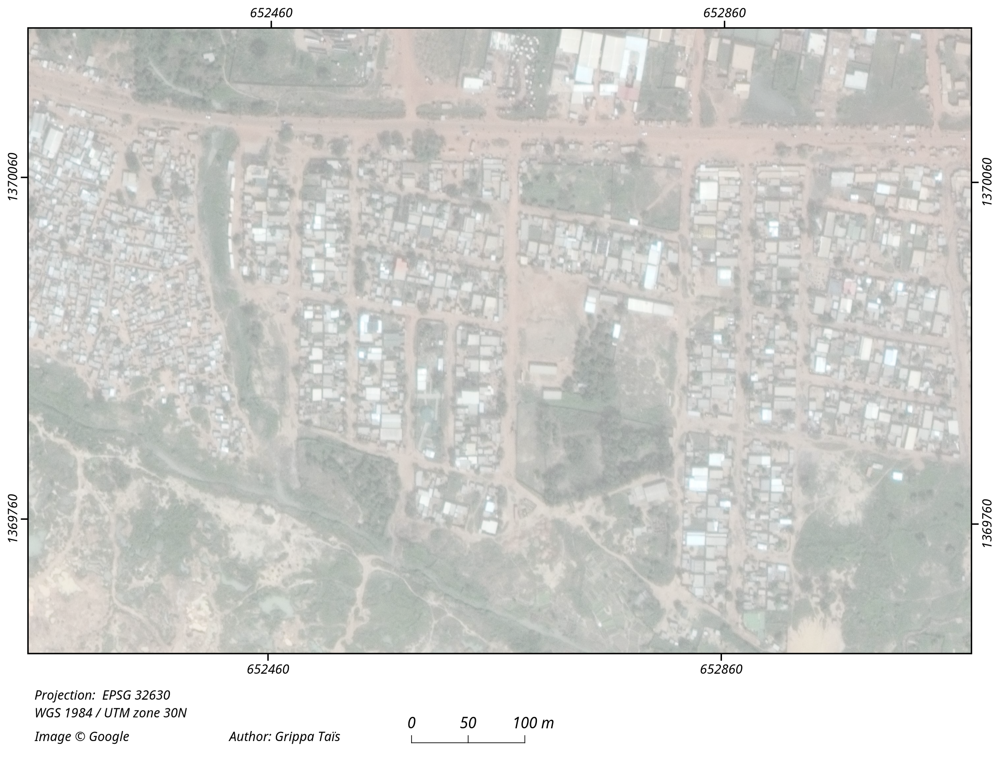

# OSM Streetblocks extraction
This repository contains a Python script (Jupyter notebook) implementing extraction of street blocks from OpenStreetMap (or other sources of vectorial data) using PostGis. 

The general workflow is as follow: 

- Input of the AOI as a polygon

- Creation of tiles for download of OSM data

- Linestrings extracted from OSM

- Extraction of street blocks polygons from linestrings

- Optical image

- Linestrings before snapping using PostGis topology

- Linestrings snapped (using PostGis topology)

- Initial extraction of street blocks - Presence of artifacts polygons

- Final street blocks layer - Artifacts were removed

# Known issues
- Some issues could appear on Windows when using 'osm2pgsql' command, regarding to the password for the Postgis databse.
