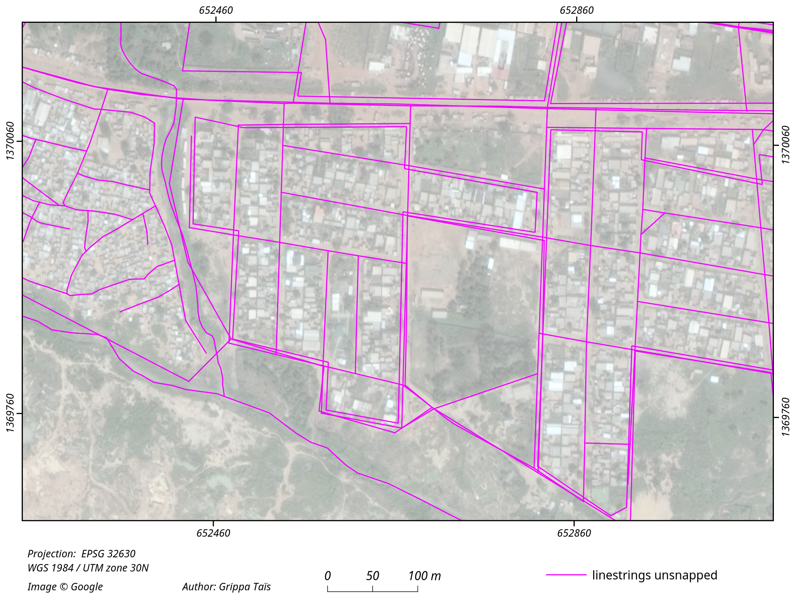
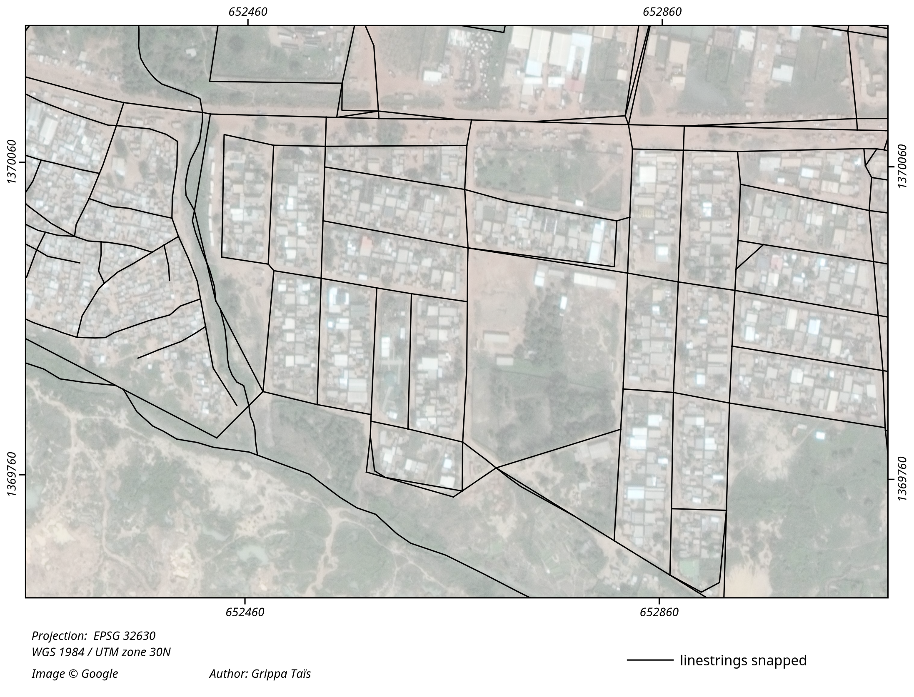
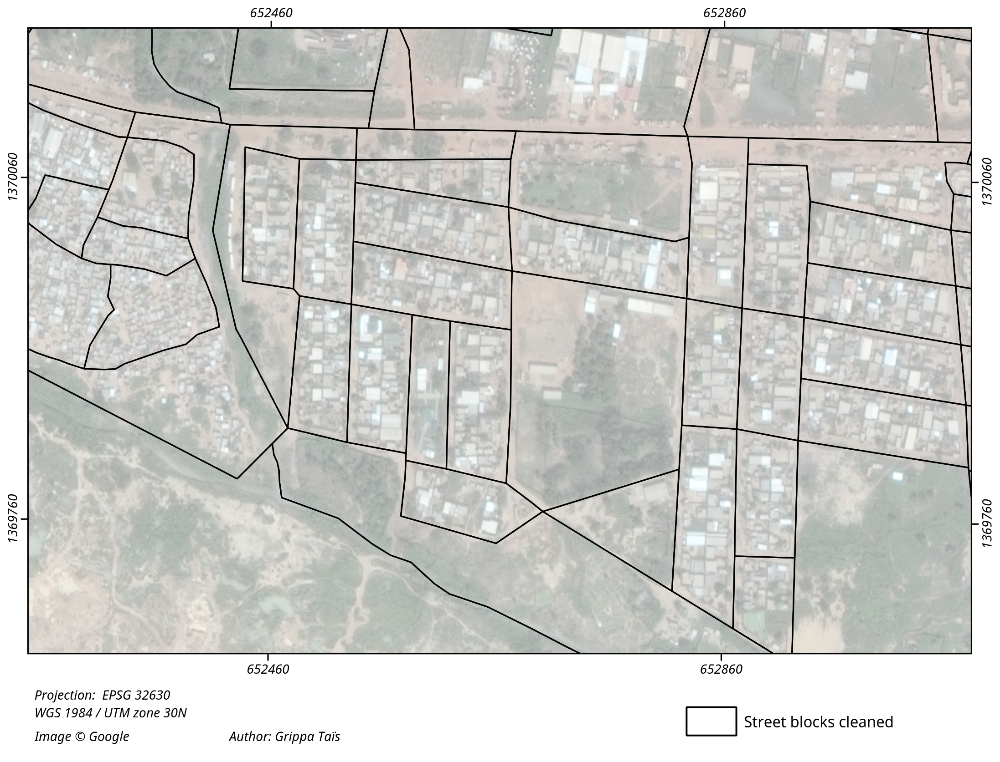

# OSM Streetblocks extraction
This repository contains a Python script (Jupyter notebook) implementing extraction of street blocks from OpenStreetMap (or other sources of vectorial data) using PostGis. 

This code was published belong to the following paper:

Grippa & al. 	Mapping Urban Land Use at Street Block Level Using OpenStreetMap, Remote Sensing Data, and Spatial Metrics. ISPRS Int. J. Geo-Inf. 2018, 7, 246. [doi:10.3390/ijgi7070246](https://doi.org/10.3390/ijgi7070246)

## Cite this code
Please use the following DOI for citing this code: 

## Related code
The code provided in this repository could be combined with the one provided in [https://github.com/ANAGEO/OSM_Streetblocks_extraction](https://github.com/ANAGEO/OSM_Streetblocks_extraction), to reproduce the aforementioned research.

## Workflow and outputs
The general workflow is as follow: 

- Input of the AOI as a polygon

- Creation of tiles for download of OSM data

- Linestrings extracted from OSM

- Extraction of street blocks polygons from linestrings

- Optical image

- Linestrings before snapping using PostGis topology

- Linestrings snapped (using PostGis topology)

- Initial extraction of street blocks - Presence of artifacts polygons

- Final street blocks layer - Artifacts were removed

## Known issues
- Some issues could appear on Windows when using 'osm2pgsql' command, regarding to the password for the Postgis databse.
- The resulting layer could contain self-intersecting polygons. Add extra step should be added after the extraction of the block in order to check is there are self-interecting polygons, and fix them in this case.
